# Project Overview

**Medi Guide Bot** is an AI-powered medical assistant integrated with Telegram.
It helps patients and doctors interact with medical records, manage appointments, and communicate efficiently — all through a conversational interface.

The system is built using:

* **LLM (via Infomaniak: `openai/gpt-oss-120b`)** for reasoning
* **LangGraph** for tool orchestration
* **PostgreSQL** for data storage
* **kDrive** for medical document storage
* **Infomaniak Calendar** to manage appointments 
* **Telegram Bot API** for user interaction

---

## How It Works

The assistant uses a **tool-based architecture**:

1. The user sends a message via Telegram
2. The system detects the user's role (patient, doctor, or unregistered)
3. A **dynamic system prompt** is generated based on the role
4. The LLM decides whether to:

   * Answer directly
   * Call one or multiple tools
5. Tools are executed (database, kDrive, calendar, etc.)
6. The assistant responds based only on trusted data sources

---
## Doctor Reply Processing (LLM Safety Layer)

When a doctor replies to a patient, the message does not go directly to the patient.

Instead, it goes through an AI validation layer before being delivered.

### Steps

#### 1. Formatting
- The doctor's message is rewritten by the LLM
- Improves clarity, tone, and structure
- Keeps the exact same medical meaning (no additions, no modifications)

#### 2. Message Validation
- The system analyzes the message to detect if it is:
  - unclear
  - incomplete
  - potentially inappropriate or confusing for a patient

- The validation is based only on the message itself  
- No access to medical records is used at this stage

#### 3. Decision Logic
- If the message is clear and appropriate → it is sent to the patient
- If the message is flagged as problematic → the doctor is warned and asked to confirm or revise

---

## Roles & Capabilities

### Doctor

Doctors have access to patient management and medical records:

* View their list of patients
* Search a patient by name
* Access patient folders stored in kDrive
* Read medical documents
* Manage appointments:

  * Check availability
  * Create calendar events
* Reply to patients with AI-assisted formatting and safety checks

Doctors cannot access patients outside their scope.

---

### Patient

Patients can interact with their own medical data:

* Access their personal medical records (kDrive)
* Ask medical questions

Important behavior:

* The assistant only answers using the patient’s records
* If no information is found:
  * The assistant offers to contact the doctor

Additional features:

* Request available appointment slots
* Book appointments
* Send messages to their doctor

---

### Unregistered User

Users who are not yet registered have limited access:

* View the list of available doctors
* Register as a new patient

---

## Architecture Overview

```mermaid
graph TD
    %% User Entry Point
    User([Telegram User]) --> TG_Bot[Telegram Bot Interface]
    TG_Bot --> Logic[handle_message function]

    %% Role Identification
    subgraph Identification ["Identity & Context Logic"]
        Logic --> DB_Lookup{Check DB}
        DB_Lookup -->|Telegram ID| DB[(SQL Database)]
        DB -->|Role & Name| Context[Build System Prompt]
    end

    %% Core Agent Flow (LangGraph)
    subgraph Agent_LangGraph ["LangGraph Flow"]
        Context --> StartNode((START))
        StartNode --> AgentNode[Node: Agent / LLM]
        AgentNode --> Condition{Tool Call?}

        Condition -->|Yes| ToolNode[Node: Tool Execution]
        ToolNode --> AgentNode
        Condition -->|No| EndNode((END))
    end

    %% Toolsets by Role
    subgraph Toolsets ["Available Tools"]
        ToolNode -.->|If Doctor| DocTools[get_patient_list, search_kdrive, calendar]
        ToolNode -.->|If Patient| PatTools[search_kdrive, read_file, relay_to_doctor, calendar]
        ToolNode -.->|If Unknown| GuestTools[get_doctor_list, create_patient]
    end

    %% External Infrastructure
    subgraph External_Services ["External Services"]
        DocTools & PatTools --> KD[kDrive - Medical Records]
        DocTools & PatTools --> Cal[Infomaniak Calendar API]
        PatTools --> Relay[Message Relay System]
    end

    %% Output
    EndNode --> FinalResponse[Final Formatted Message]
    FinalResponse --> TG_Bot
    TG_Bot --> User

    %% Styling
    style Agent_LangGraph fill:#1d2b3b,stroke:#0056b3
    style DB fill:#1d2b3b,stroke:#01579b
    style KD fill:#494540,stroke:#e65100
    style Cal fill:#576b59,stroke:#1b5e20
    style Identification fill:#3d3d3d,stroke:#333
```

